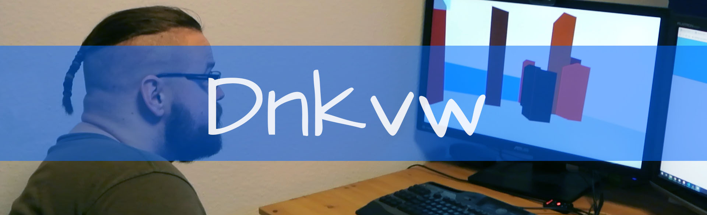
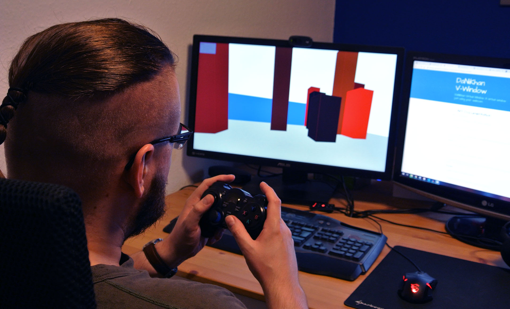
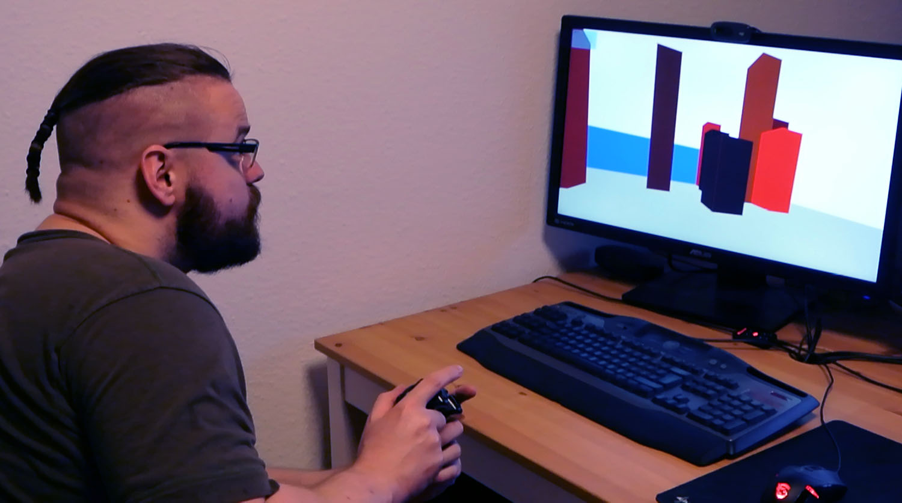
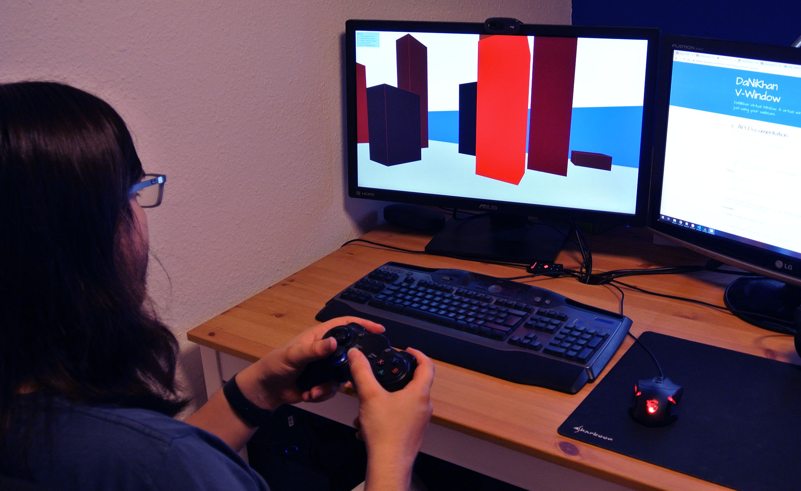
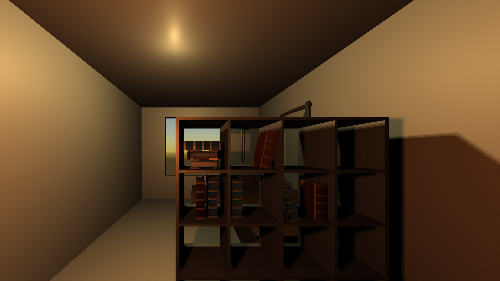

# Images & Demos
[Back to home](../)

## Demos
These demos are usable examples of dnkvw. You can use them as a starting point for the usage of dnkvw.

* [Dnkvw Raylib Example](https://github.com/DaNiKhan-GbR/Dnkvw-Raylib-Example) • [Download](https://github.com/DaNiKhan-GbR/Dnkvw-Raylib-Example/releases)
* [Dnkvw Unity Plugin](https://github.com/DaNiKhan-GbR/Dnkvw-Unity-Plugin) • [Download](https://github.com/DaNiKhan-GbR/Dnkvw-Unity-Plugin/releases)

## Templates
You can use templates to start your own project based on Dnkvw and other libraries.

* [Dnkvw Raylib Minimal Example](https://github.com/DaNiKhan-GbR/Dnkvw-Raylib-Minimal-Example) • [Download](https://github.com/DaNiKhan-GbR/Dnkvw-Raylib-Minimal-Example/releases)

## Images & Videos

    <iframe 
        width="90%"
        height="315"
        src="https://www.youtube-nocookie.com/embed/j2izIeZ40t4?rel=0&showinfo=0" 
        frameborder="0" 
        allow="accelerometer; autoplay; encrypted-media; gyroscope; picture-in-picture" 
        allowfullscreen
    ></iframe>

